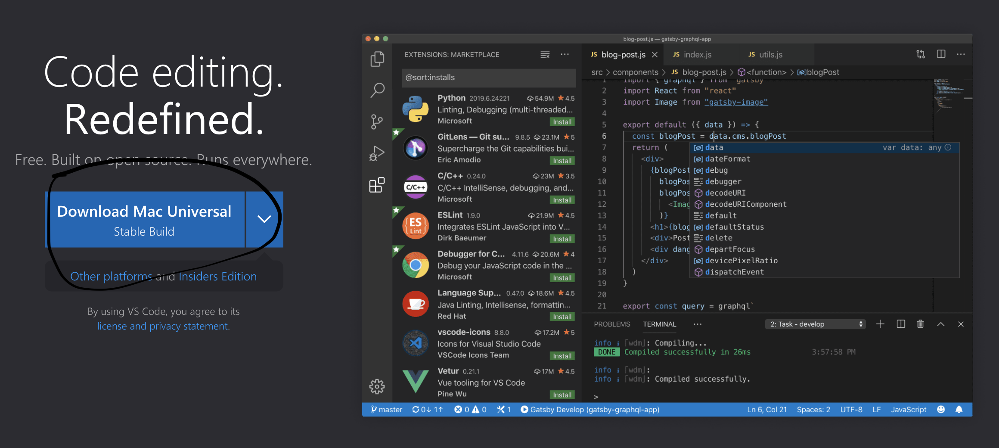
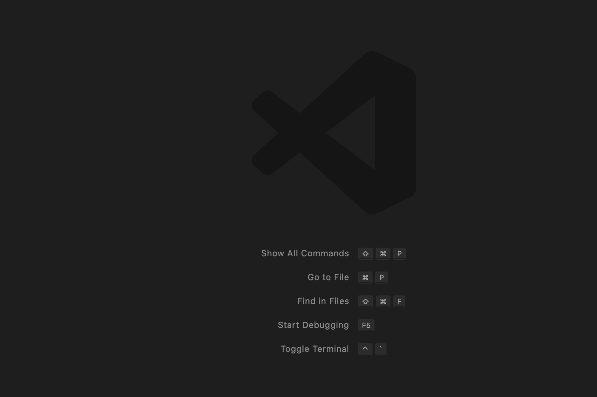
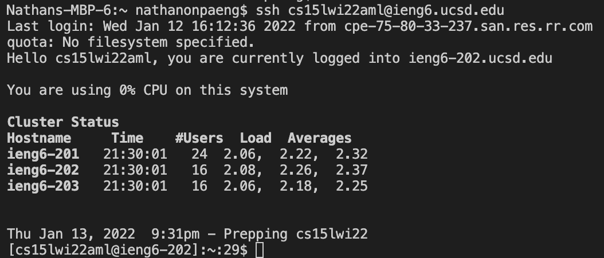
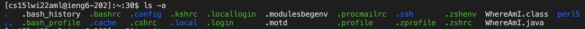
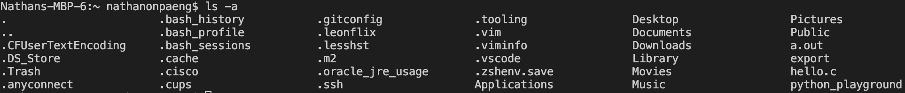
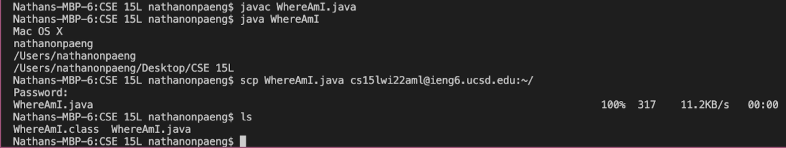
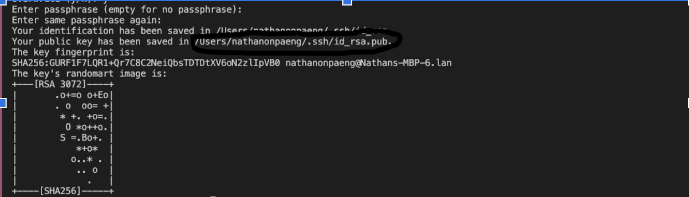
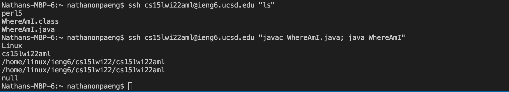

# Lab Report 1 

## Installing VScode ##
---
>

When installing VScode for the first time, you would go to the [VScode](https://code.visualstudio.com/) website to download the correct version for your OS. You should then be able to open VScode on your computer and be directed to a screen that looks like the picture shown below. From this screen, you can follow the commands to open or find a file to continue on with your coding environment.

>

## Remotely Connecting ##
---
In order to remotely connect to the server, you first need to look up your UCSD specific account on the [Account Lookup website](https://sdacs.ucsd.edu/~icc/index.php). Once that is found, it is essential to change your password in order to activate the account and make sure that the new password is active for the rest of your course specific accounts. 

Once you are able to create a new password, you can access the remote server with the command `ssh` in combination with your username that you looked up on the UCSD website in the terminal. You are then prompted to enter the new password you created (Note: the characters will not show up, but they are registered in the remote server). When logging into the server, it should look something like this:

>

## Trying Some Commands ##
---
Some of the commands that I found to be the most useful in the terminal and the remote server are those that are able to tell more about the remote server and those that connect the remote server to your local computer. Interesting to note that some commands have different outputs depending on which computer you are on. Notably, the `ls -a` command shows the different dot files on the local computer and the remote server.

>Remote Computer:

>Local Computer:

## Moving Files with `scp` ##
---
When moving files from our local computers to the remote computers, it is important to compile and save the edits made offline local computer first so that these changes can be seen in the remote server. To do so, we would compile with `javac` like how we would normally do for each file we want to compile and then we would use the `scp` command with the given file we would like to move and our UCSD given account name to successfully move it to the remote server. 

>

## Setting an SSH Key ##
---
The purpose of setting an SSH key is so that logging into the server is seemless instead of a hassle, and the way to generate this key is by inserting `ssh-keygen` on your **local** terminal to generate a random key. (Remember the circled portion of the picture below.)

>

Then, it is necessary to log back into the server with the password you created since the key will not activate unless the following steps are executed in the server. Once in the server, you then need to input `mkdir .ssh`, log out using `exit` and then enter this specific command with your *own* username and path to the id_rsa public key file given to you when you generated the key:
>

After this is done, you should be able to log in using the `ssh` command without a password.

## Optimizing Remote Running ##
---
Some of the ways that remote running can be optimized are commands that can access the remote server and immediately come back into the local computer. This negates the process of logging into the server and exiting, making for a more streamlined process. These commands revolve around having quotation marks on the command that you would like to use in the remote server like so: 

>