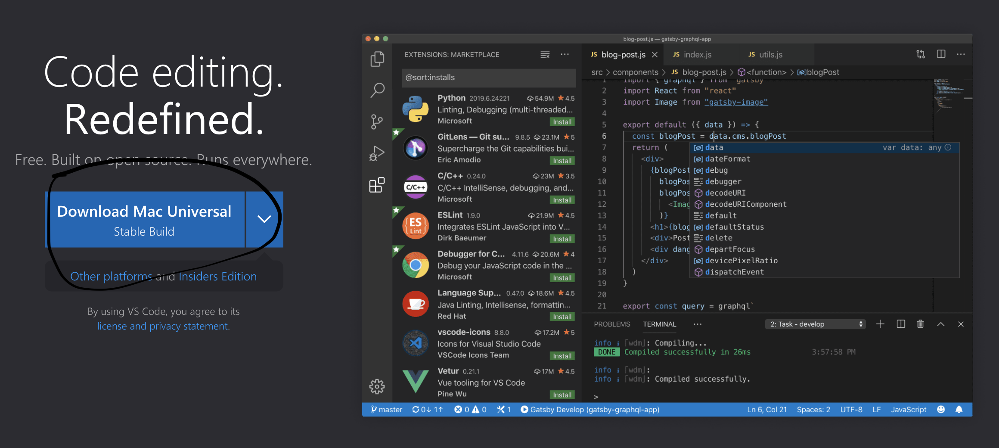

# Lab Report 1

## Installing VScode ##

When installing VScode for the first time, you would go to the [VScode](https://code.visualstudio.com/) website to download the correct version for your OS. You should then be able to open VScode on your computer and be directed to a screen 

