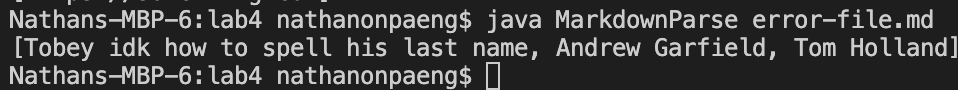
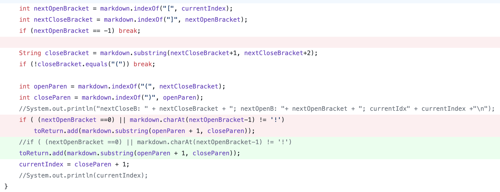
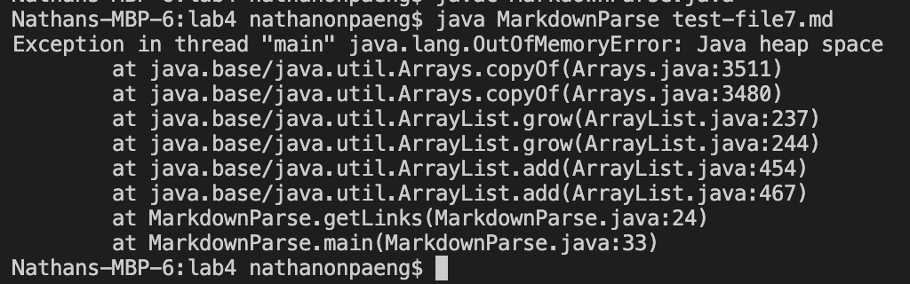
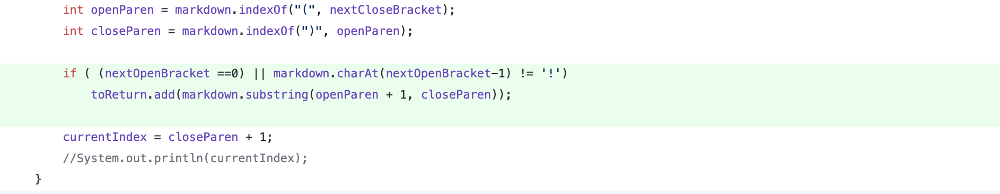
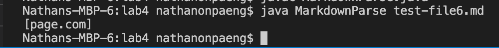
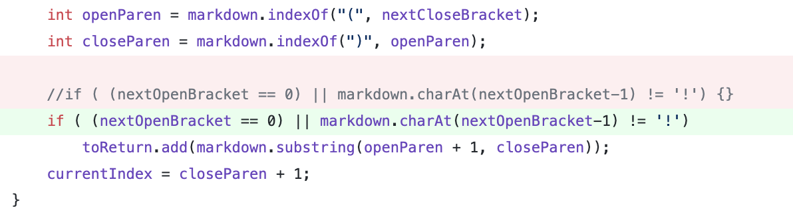

# Lab Report 2

## Text in between bracket and parenthesis
---
[The file of code that caused the error](error-file.md)

The output of the file with the failure inducing input:
>

The code change:
>

### Relationship between bug, symptom and input for Issue 1:
The bug in this case was a problem in the code where it read past the code from the close bracket and searched for the next instance of an open parenthesis. The symptom is that it provided the wrong output for the test file given that it should not read anything in the parenthesis since it is not in a link format given by a markdown file. The input is looked at and it is seen that the reason that this is an issue is due to the code itself and there must an addition to the original code where `String closeBracket = markdown.substring(nextCloseBracket+1, nextCloseBracket+2);` is representative of the space in between the close braket and the open parentheses and we would add the piece of code `if (!closeBracket.equals("(")) break;` to check this specific case.

## Not Returning an Empty List When Formatting is Off
---
[The file of code that caused the error](test-file7.md)

The output of the file with the failure inducing input:
>

The code change:
>

### Relationship between bug, symptom and input for Issue 2:
The bug in this case was the non-inclusion of specific codes that would catch the case in which the links expression in a markdown parse file is properly constructed. The symptom will show an Error since in our groups testing of this code, the input would produce an infinite loop. Since the code's bug is that there was no line of code that resolved the symptom given the input, we had to add a bit of code `if (!closeBracket.equals("(")) break;` to help resolve this particular symptom.

## Image Link Returning
---
[The file of code that caused the error(it is an image file so it will only show an image)](test-file6.md)

The output of the file with the failure inducing input:
>

The code change:
>

### Relationship between bug, symptom and input for Issue 3:
The bug in the case of the Image format in the markdown file still reading whatever was in the parenthesis (input) gave the symptom of not giving the correct output, in which it should return an empty array. To correct this error, we would have to input more code in our original file in order to debeg the code. The given piece of code was adding an if statement to determine if the given format was an image in the form of the code `if ( (nextOpenBracket == 0) || markdown.charAt(nextOpenBracket-1) != '!')`. 

## Relationship Between bug, symptom, and failure-inducing input
---
In terms of discussing the relationship between bug, symptom and failure-inducing input, it is important to take an iterative and patient to approaching the issue. When the symptom first arises, it is usually in the form of a terminal error, where either an error/exception or wrong output is present. In the case this happens, you will examine the input (the different file tests in our case), and analyze how the bug in the code itself can be resolved, whether it is adding more code to resolve the symptom, fixing the bug with adjustments to it, or deleting the bug all together. In testing and debugging, it is important to not do too many things at once, since this can negatively affect your code and make what was once working, not work and this can lead to more confusion.

