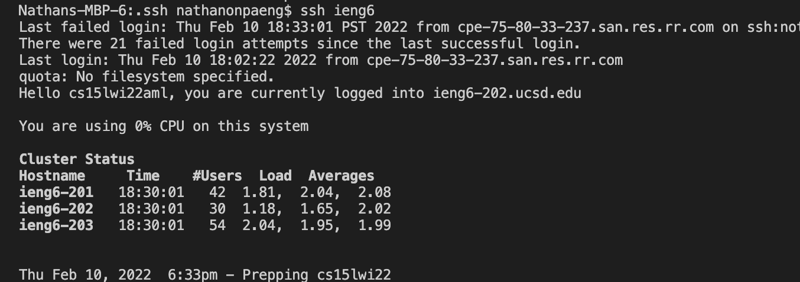

# Lab Report 3
## Streamlining ssh Configuration
---
In order to make the config file in the `.ssh` directory based in the local computer, we first need to access the `ssh` directory, which can be done with a simple `cd .ssh` from the `~` directory and the config file can be made by the command `echo some text > config` to make the file on the .ssh directory. Then it is opened directly on the terminal through `open config` and then the editing of the file will occur. 

### Edits to Config file:
> 

In terms of editing the file, we want to put the Host as any arbituary alias that is easy to remember, as this is the word that is used to access the remote server easily in the terminal. Then, we want the host name to be the address of our remote accounnt and the user to be the username for said remote account. 

The IdentityFile portion is to make the ssh sign in even more streamlined, as it has the access key generated from Lab 1, thus it removes the need to have a password whenever you want to access the remote server using the command `ssh ieng6` in our case.

### ssh Login Using Alias:
> 

We can see here that by using the alias ieng6 that we were able to log into the remote server with one command, making it more streamlined.

### Using scp with alias 

The command being run on the terminal:
>

The result of the command:
>

By using the `scp` command with the new alias, we can see that the line used in the terminal is much more simplified as there is less typing to do. Thus, we have configured the `ssh` command so that it is more streamlined and the remote server is easier than ever to access.
