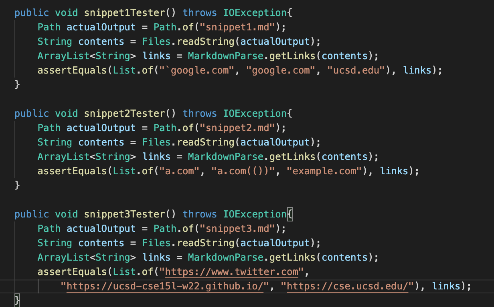
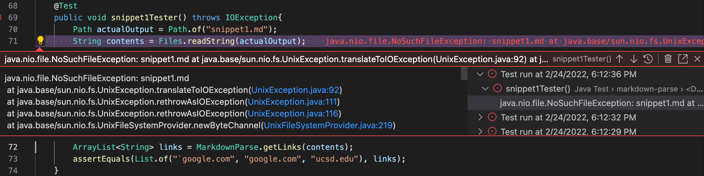
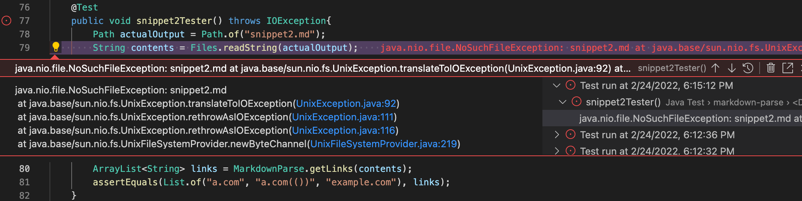
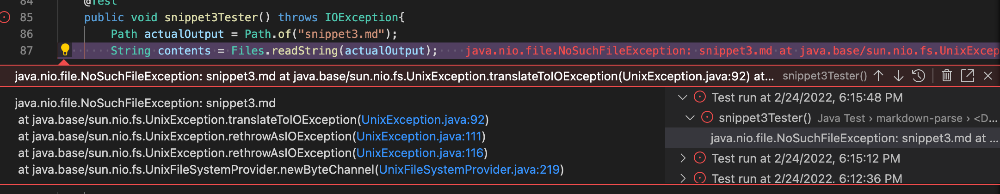
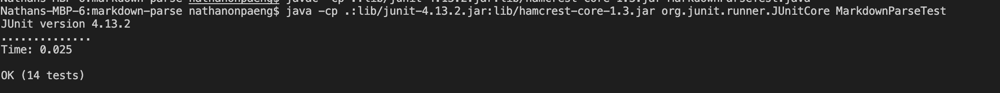

# Lab Report 4

[Link to Our Groups Repository](https://github.com/nonpaeng/markdown-parse-lab3)

[Link to the Group We Reviewed](https://github.com/vs2961/markdown-parse)

## Expected Outputs for Each Snippet
---
Snippet 1:
[`google.com, google.com, ucsd.edu]

Snippet 2: 
[a.com, a.com(()), example.com]

Snippet 3: [https://www.twitter.com, https://ucsd-cse15l-w22.github.io/, https://cse.ucsd.edu/]

## Test Conversion in MarkdownParseTest.java
---
>

## Output for My Implementation 

### Snippet 1:

>

### Snippet 2:
>

### Snippet 3:
>

## Other Groups Output in JUnit
All of the tests ran from the other groups implementation were able to pass successfully.
>

**Do you think there is a small (<10 lines) code change that will make your program work for snippet 1 and all related cases that use inline code with backticks? If yes, describe the code change. If not, describe why it would be a more involved change.**

>One of the changes that can be made with the code is that we can add an if statement of checking the backticks within the string of the links and where they are placed in the string, which can be less than 10 lines. Sometimes, checking for backticks can be tricky since it is a broad question of what classifies as a valid link.

**Do you think there is a small (<10 lines) code change that will make your program work for snippet 2 and all related cases that nest parentheses, brackets, and escaped brackets? If yes, describe the code change. If not, describe why it would be a more involved change.**

>One of the changes that can be made in the code to check for nest parenthesis is checking for the first instance of a complete link format in markdown (``). Perhaps, another check that can be done to related cases is to see if there exists an outer parenthesis that encloses the nest ones. This fix I believe could be done in less than 10 lines.

**Do you think there is a small (<10 lines) code change that will make your program work for snippet 3 and all related cases that have newlines in brackets and parentheses? If yes, describe the code change. If not, describe why it would be a more involved change.**

>One of the changes that can be made to the code to check for new lines is by checking if there if there is a parenthesis that exists throughout the code, disregarding the newline. This would involve another while loop, and there is some nuance on if this would exceed 10 lines since there would have to be another if/else check or verification of the link inside of the parenthesis in order to parse it.