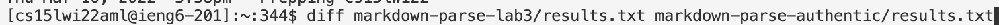
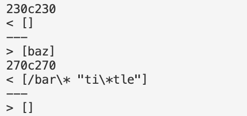
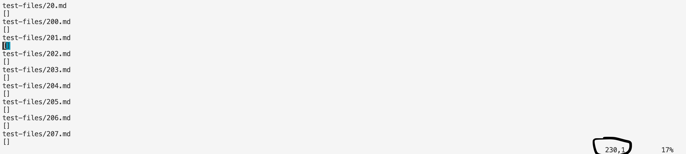
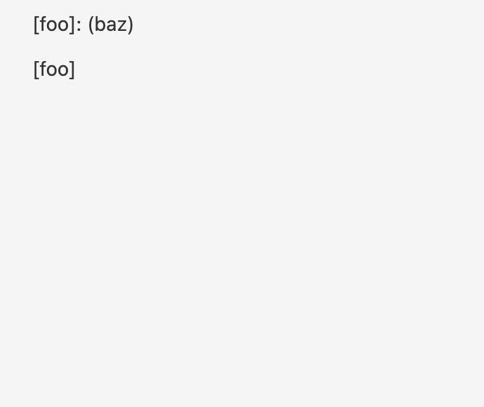
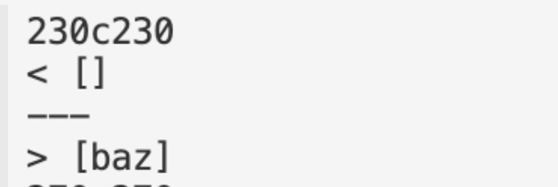
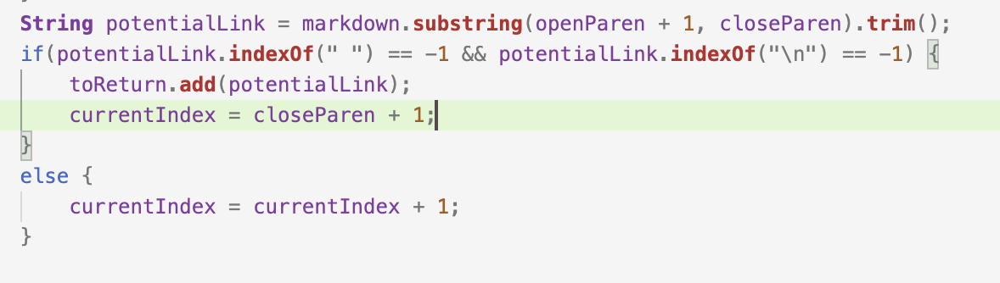
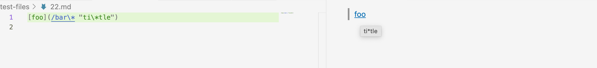
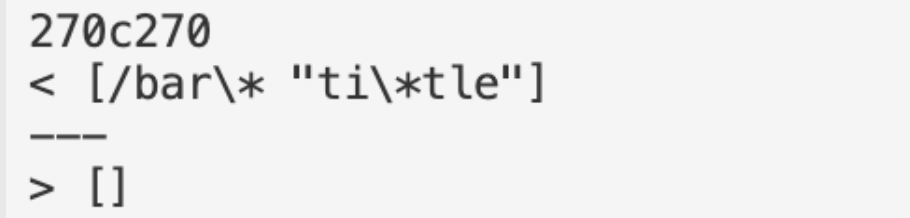

# Lab Report 5

When finding the different tests from my own implementation against the implementation given to us, I used the results.txt file that we made for both our repository and inputted the following command to compare the differences between the outputs of each implementation of MarkdownParse.java. Both of these implementations and their result.txt files were present on the ieng remote server.
>

The following output of the `diff` command outputs the diffences between each file, in which the two numbers represent the lines in where the diffrence occurs in each file.
`>` represents the output of my implementation, while `<` represents the output for the class implementation.
>
**The two tests we will be using for this lab.**

In order to find which test files these differences occur in, I used the vim format in the remote server to see the results.txt file of one implementation. By looking at the vim file, we can use the numbers outputted by `diff` to see which file within test-files that the difference occurs. 

For example, since one of the diffrences occur at line 230 for each file, we will see in vim, it will tell us which line we are in for the file. We find at line 230, the corresponding test file is test-files/201.md, and so that is one of the test files that the difference occurs on.
>

## Test 1: test-files/201.md
Expected Output: []
>

Actual Output:
>
**The first output is my own, the second output is the class implementation.**

The implementation that is correct is my own, since in the VSCode preview of the markdown file, nothing registers as a valid link.

The bug that I think needs to be fixed in the class implementation of MarkdownParse is that in the getLinks(String markdown) method, and that when it parses through a potential link, it does not account for the fact that when there is a colon after the brackets, it does not consitute as a valid link. A fix could be that it accounts for the colon in the if statement.
>
**Where the bug occurs in the class implementation**

## Test 2: test-files/22.md
Expected Output: [ti*tle]
>

Actual Output:
>

The implementation in both codes is wrong.

The bug in both codes is that it does not account for backslashes or forward slashs as being in valid, as well as a link being in quotation marks being a valid link. For my implementation, it copies everything within the parenthesis, since it consitutes a valid link as something within the parenthesis. On the contrary, the validity of a link in the class implementation is constituted as something with no spaces in bewteen anything in the parenthesis. A proposed fix for both codes would be to check if there is a valid link in between two blocks of quotation marks within the parenthesis.

